# HR Onboarding Agent - System Design Document

**Document Version Control**

| Version | Date       | Author   | Change Description                                      |
|---------|------------|----------|--------------------------------------------------------|
| 1.0     | 2025-11-25 | Md Sahil | Initial draft, including introduction and system overview sections. |

---

## Table of Contents

1. [Introduction](#1-introduction)
2. [Recruitment Process Flow](#2-recruitment-process-flow)
3. [System Overview](#3-system-overview)
4. [Infrastructure Architecture](#4-infrastructure-architecture)
5. [Technology Stack](#5-technology-stack)
6. [User Roles & Access Hierarchy (RBAC)](#6-user-roles--access-hierarchy-rbac)
7. [Architecture Design](#7-architecture-design)
8. [Module Descriptions](#8-module-descriptions)
9. [Data Design](#9-data-design)
10. [Deployment Architecture](#10-deployment-architecture)
11. [Compliance & Data Retention](#11-compliance--data-retention)
12. [Risks & Mitigations](#12-risks--mitigations)
13. [Success Metrics & KPIs](#13-success-metrics--kpis)
14. [HR Recruitment Process Flow](#14-hr-recruitment-process-flow)

---

## 1. Introduction

### 1.1 Purpose

The **HR Onboarding Agent Project** aims to digitize and automate the end-to-end **recruitment and onboarding process** for Sampurna Financial Services Pvt. Ltd. (SFSPL).

#### ❌ Previous Challenges

**Manual Process Issues:**
- ❌ Data loss and duplication
- ❌ Delayed and unstructured communication
- ❌ Limited visibility on candidate progress
- ❌ No track of interview lifecycle
- ❌ No scope for analysis
- ❌ Manual handling via WhatsApp, Excel sheets, and emails

#### ✅ Solution Objectives

**Centralized Digital System Benefits:**
- ✅ Secure storage of all candidate and interview data
- ✅ Automated screening, evaluation, scheduling, and tracking
- ✅ Real-time visibility of onboarding progress
- ✅ Reduced manual dependency and enhanced HR efficiency
- ✅ Interview process and quality analysis

#### 📑 Problem Statement

The current employee onboarding process is highly manual and lacks digital structure. Candidates send CVs via WhatsApp, HR contacts them for preliminary questions, and interviews are conducted offline. Information is not systematically recorded, resulting in:

- No centralized or organized database
- Only mandatory details entered into HRMS
- Significant data loss and inefficiency
- Difficulty tracking and analyzing recruitment trends

### 1.2 🎯 Scope

#### ✅ In Scope
- Candidate registration & digital forms (Form-1 to Form-4)
- Interview scheduling & panel allocation
- Profile, document & KYC management
- Onboarding checklist & task tracking
- Email & WhatsApp notifications (via n8n)
- PostgreSQL centralized database
- Multilingual interface (English, Hindi, Bengali)
- Analysis & Reporting

#### ❌ Out of Scope
- Full automation for background verification
- Direct integration with Octane
- Auto mail from HR mailbox
- Auto selection of candidates

---

## 2. Recruitment Process Flow

### Recruitment Process Flow Diagram

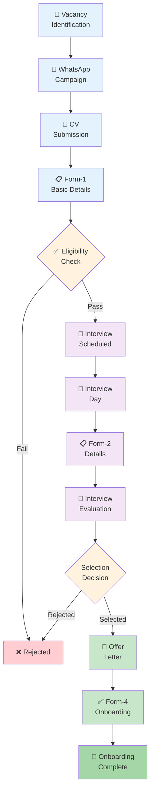

**[Diagram 1: Complete Recruitment Flow]**

---

### 2.1 Data Flow Diagram

#### Level-0: System Context

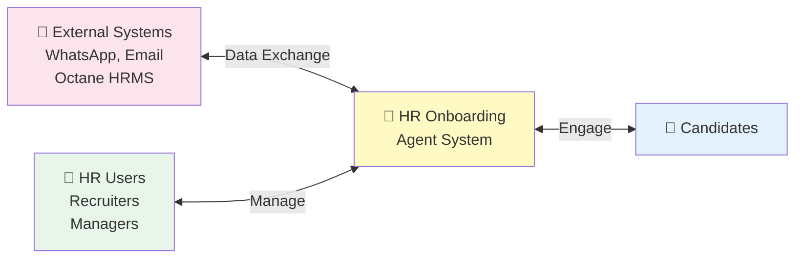

**[Diagram 2: Data Flow Level-0]**

#### Level-1: Detailed Processes

- **Process 1:** Candidate Registration (Forms 1-4)
- **Process 2:** Interview Scheduling & Management
- **Process 3:** Decision & Notification
- **Process 4:** Onboarding Task Tracking
- **Process 5:** Analytics & Reporting

---

### 2.2 Technology Stack and Architecture

**Core Technology Stack:**

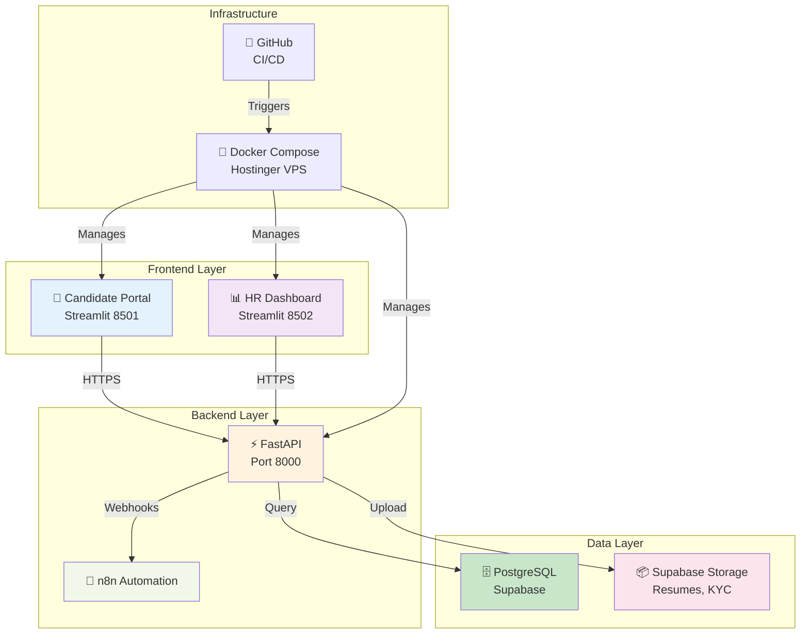

**[Diagram 3: Technology Stack Architecture]**

---

### 2.3 👥 Target Audience

| Role | Responsibilities |
|------|------------------|
| HR & Business Users | Process owners, approvers, end users |
| System Architects | Review system components and overall architecture |
| Developers | Implement modules based on design |
| Database Administrators | Maintain PostgreSQL/Supabase schema and data integrity |
| Security & Compliance Team | Verify encryption, access control, and data retention |
| IT & DevOps Team | Manage deployment, monitoring, and version control |
| Management / Stakeholders | Approve scope, KPIs, and release milestones |

---

## 3. 🌐 System Overview

### 3.1 System Overview

The **HR Onboarding Agent** serves as a **web-based digital platform** that connects candidates, recruiters, and HR teams in one centralized ecosystem.

**Key Platform Features:**
- Streamlit-based user interfaces for candidates and HR
- FastAPI backend for business logic and API services
- PostgreSQL database for centralized data storage
- n8n automation for notifications and workflow triggers
- Supabase storage for documents and file management

**[Diagram 4: System Architecture Overview]**

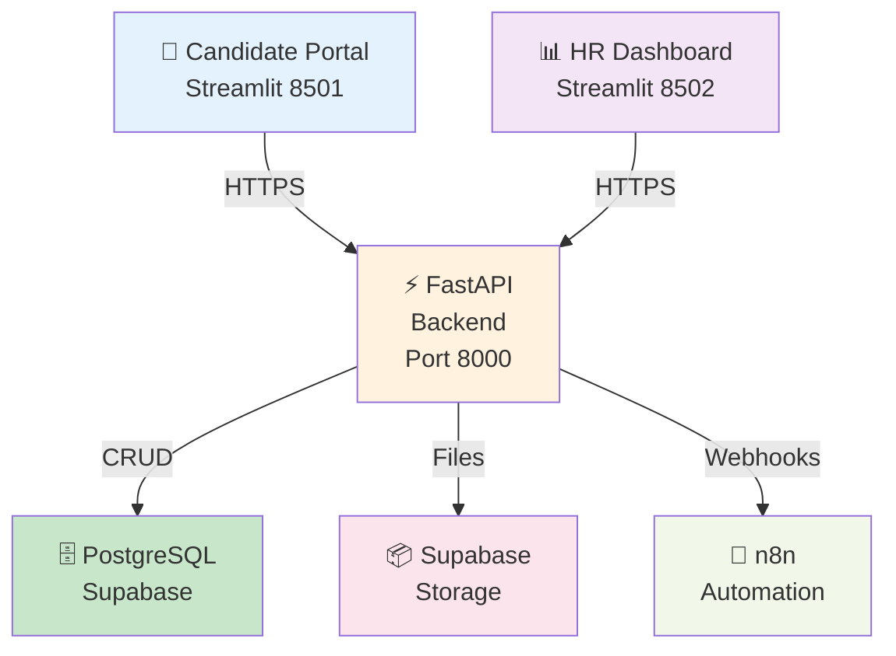

### 3.2 🎯 Key Objectives

| Category | Objective | Outcome |
|----------|-----------|---------|
| Business | Eliminate manual WhatsApp/Excel-based tracking | Improved process reliability |
| Business | Reduce HR workload through automation | 60% less manual data handling |
| Business | Interview efficiency analysis | Helps understand interview quality |
| Technical | Store all data digitally | PostgreSQL-based centralized DB |
| Technical | Integrate automated notifications | Improved candidate communication |
| Operational | Track onboarding progress | Transparent HR reporting dashboard |

---

## 4. Infrastructure Architecture

### 4.1 Hosting Environment

The HR Onboarding Agent is hosted on a **Hostinger VPS** and follows a **Docker-based deployment model** for isolation, scalability, and simplified maintenance.

| Component | Environment | Purpose |
|-----------|-------------|---------|
| FastAPI Backend | VPS (Ubuntu 22.04) | Core business logic and API services |
| Streamlit Frontend | VPS | HR and Candidate user interfaces |
| PostgreSQL (Supabase) | VPS | Centralized database for recruitment and onboarding |
| n8n Automation | Internal Docker Service | Notification handling (Email, SMS, WhatsApp) |
| Blob Storage (Supabase) | VPS | Secure file storage for resumes |

### 4.2 🔒 Security & Networking

#### Security Measures
- ✅ HTTPS enforced (TLS 1.2+) with Let's Encrypt SSL
- ✅ Firewall rules restrict access to ports 80, 443, 22
- ✅ Role-based access control (RBAC)
- ✅ Daily backups with 30-day retention

#### Network Architecture
- API and database communicate via private network
- TLS at each application layer
- JWT authentication
- Optional DB Row-Level Security (RLS)

### 4.3 📐 Logical Topology

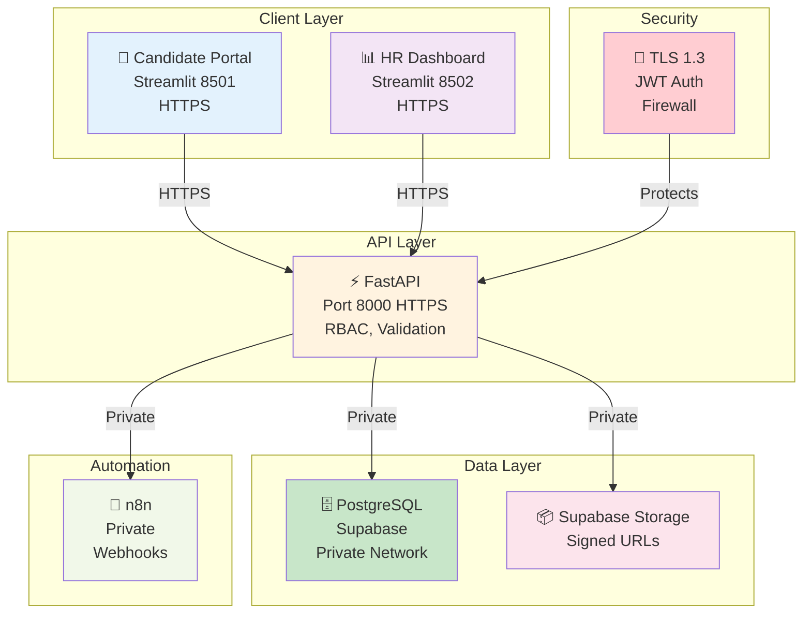

**[Diagram 5: Logical Topology]**

---

## 5. Technology Stack

### 5.1 Stack Components

| Layer | Primary Technology | Why Chosen | Notes |
|-------|-------------------|-----------|-------|
| Frontend & UI | Streamlit (Python) | Fast internal apps, form-heavy UI, minimal JS | Candidate Portal, HR Dashboard |
| Backend | FastAPI (Python) & n8n | High-performance async APIs, Pydantic validation, OpenAPI | Service layer + auth + business rules |
| Database | PostgreSQL (Supabase) | ACID, JSONB, solid indexing, easy backups | RLS-ready; UUID keys; audit tables |
| Storage | Supabase Storage | Signed URLs & lifecycle policies | Resumes, KYC, offer PDFs |
| Containerization | Docker Compose | Environment parity, reproducible builds | DEV/UAT/PROD |
| BI & Dashboards | Python (pandas + Plotly) | Quick analytics & exports | Runs inside HR Dashboard |
| Version Control | Git / GitHub | PR reviews, issues, Actions CI | Branch policy: main protected |

### 5.2 Component-to-Tool Mapping

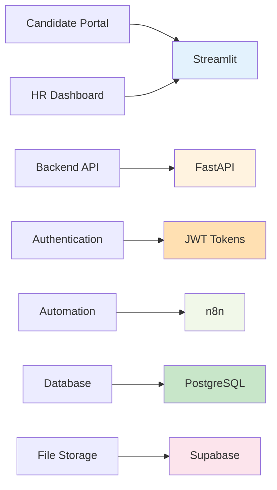

### 5.3 🔒 Security Baselines

#### Authentication
- JWT (access/refresh tokens)
- Bcrypt passwords for HR users
- OTP for candidates

#### Data Protection
- TLS on all endpoints
- Signed URLs for files
- Least-privilege DB roles

### 5.4 CI/CD Overview (GitHub)

```
Lint → Tests → Build Docker Images
         ↓
Push to Registry → Remote Docker Compose Up
         ↓
Alembic Upgrade → Smoke Tests → Production
```

**Branches:** `feature` → `PR` → `main` (protected)

### 5.5 🔮 Future Enhancements

#### ✨ Planned Features
- Streamlit component polish
- WhatsApp chatbot with map facilities
- Maximize automation

#### 🎯 Strategic Goals
- Ensure Security & Compliance
- Make it sellable as product

---

## 6. User Roles & Access Hierarchy (RBAC)

### 6.1 Role Catalog (Least-Privilege)

| Role | Responsibilities |
|------|------------------|
| Super Admin | User provisioning, environment/config toggles |
| HR Manager | Approvals, final decisions, reports |
| Recruiter | Intake, screening, schedule interviews, draft updates |
| Interviewer | View assigned candidates, submit Form-3 only |
| Compliance/Audit | Read-only to audit logs/reports |
| Candidate | Own profile/forms/documents; track status, ask questions through chatbot |

### 6.2 🔐 Permission Snapshot (CRUD + Approvals)

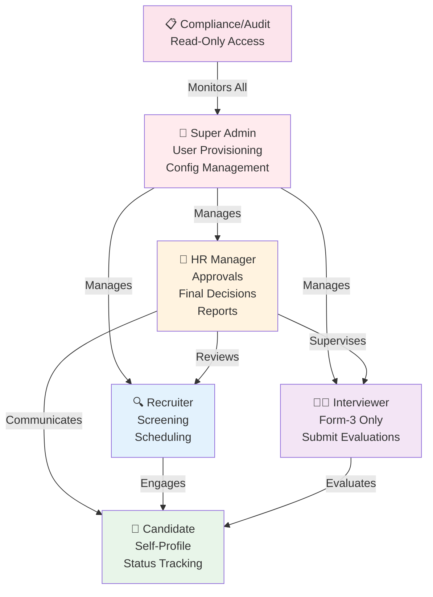

### 6.3 📋 Data Scope & Session Policy

| Aspect | Policy |
|--------|--------|
| Scope | Candidate=self; Interviewer=assigned_only; Recruiter=branch/assigned; HR Manager=department/global |
| HR Sessions | 8h session (2h idle timeout) + optional MFA for managers |
| Candidate Sessions | 24h session with OTP authentication |
| RLS (Optional) | Policies by candidate_id, branch, or assignment in Supabase |

---

## 7. Architecture Design

### 7.1 🧩 Components

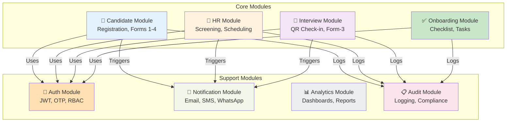

### 7.2 🔄 Component Interactions

| Step | Interaction |
|------|-------------|
| Step 1 | Candidate opens Streamlit Form → Provides mobile number → FastAPI verifies conditions → Redirects to form |
| Step 2 | Forms post JSON → FastAPI validates → Writes to PostgreSQL |
| Step 3 | File uploads → FastAPI requests signed URL → Streamlit uploads to Supabase Storage |
| Step 4 | HR actions (screening, scheduling, decisions) → FastAPI/n8n updates DB → Triggers automation webhooks |
| Step 5 | Dashboards/analytics → Streamlit queries DB views for read-only data |

### 7.3 📊 Sequence Diagram (Happy Path)

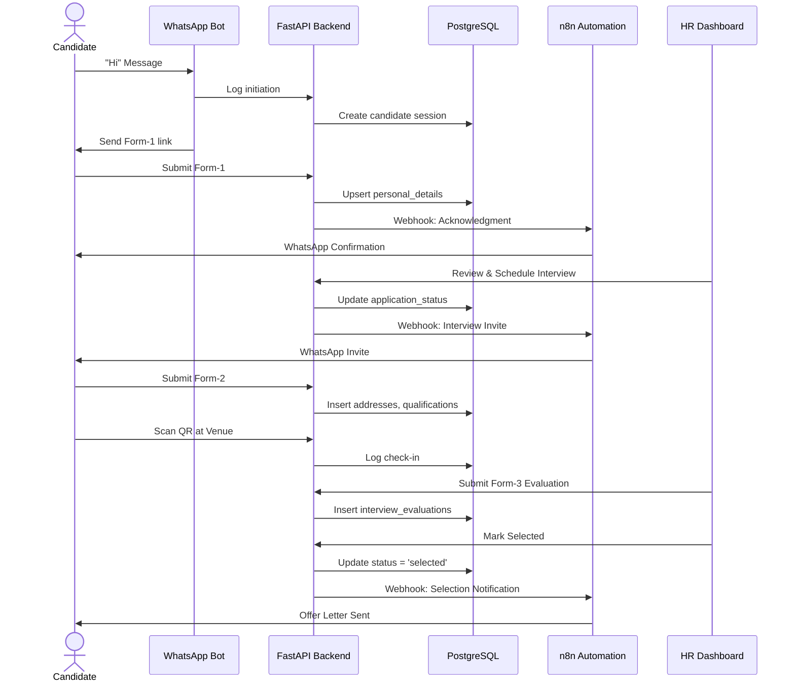

---

## 8. Module Descriptions

### 📝 8.1 Candidate Management

**What it does:**
Mobile number based login, Form-1 (basic), Form-2 (details), document uploads, status tracking.

**Key Flows:**
1. WhatsApp "Hi" → Form-1 link → Eligibility check (number + 30-day rule)
2. Form-1 upsert personal_details + insert candidate_applications
3. Form-2 writes addresses, qualifications, skills, documents

**UI:** Streamlit forms + status timeline

---

### 👔 8.2 HR Management

**What it does:**
Screening, shortlist/reject, interview scheduling (date/time/location), offer decision gate.

**Notes:**
Scheduling updates are the trigger-point for automation to send invites.

---

### 🎤 8.3 Interview Management

**What it does:**
QR check-in at venue, Form-3 evaluation (ratings + remarks).

**Rules:**
Interviewer loads Form-3 by candidate mobile; writes interview_evaluations, updates application status.

---

### 📄 8.4 Offer & Final Decision

**What it does:**
Post-selection but before joining: Creates checklist, captures joining/KYC documents, verifies completion.

---

### ✅ 8.5 Onboarding Tasks

**What it does:**
Post-selection but before joining: Creates checklist, captures joining/KYC documents, verifies completion.

**Triggers:**
- Candidate selection completion
- Form-4 submission initiation

**Mechanism:**
FastAPI creates onboarding checklist → n8n sends reminders → Streamlit tracks completion

---

### 📧 8.6 Notifications (via Automation)

**Triggers:**
- Form-1 acknowledgment
- Interview invite/reminders
- Decision notice
- Onboarding welcome

**Mechanism:**
FastAPI emits webhooks → n8n automation sends WhatsApp/Email/SMS; delivery logged.

---

### 📊 8.7 Analytics & Reporting

**Dashboards:**
- Pipeline funnel (candidates at each stage)
- Time-to-hire metrics
- Source effectiveness
- Interview-to-decision ratios
- Department-wise hiring trends

**Built with:** Streamlit + read-only SQL views; export CSV/PDF

---

### 📋 8.8 Remaining Data Collection (Form-4)

**What it does:**
Post-selection but before joining: Candidate fills Form-4 during induction for remaining personal details capture.

---

## 9. Data Design

### 9.1 Overview

- **Style:** Normalized 3NF; UUID keys; UTC timestamps
- **Security:** PII encrypted at rest (DB/storage)
- **Identity:** Candidate identified by mobile + email
- **Application:** Per-position per candidate tracking

### 9.2 🗂 Core Entities

| Entity | Purpose | Key Columns (Sample) |
|--------|---------|----------------------|
| personal_details | Canonical candidate profile | candidate_id (PK), mobile_no (unique), email (unique), full_name, last_seen_at |
| candidate_applications | One per application/role | application_id (PK), candidate_id (FK), job_code, status, applied_at |
| addresses | Permanent/current addresses | address_id (PK), candidate_id (FK), type, city, state, pincode |
| qualifications | Degrees/certificates | qualification_id (PK), candidate_id (FK), degree, year |
| skills | Skill inventory | skill_id (PK), candidate_id (FK), skill_name, level |
| documents | Resume/KYC files | document_id (PK), candidate_id (FK), application_id (nullable FK), doc_type, signed_url |
| interviews | Scheduled interview slots | interview_id (PK), application_id (FK), slot_ts, mode, location |
| interview_evaluations | Panel feedback | evaluation_id (PK), interview_id (FK), criteria JSONB, overall_score, remarks |
| application_status_history | Immutable audit trail | id (PK), application_id (FK), from_status, to_status, changed_at, changed_by, note |

### 9.3 🔄 Data Flow Summary

| Form/Stage | Data Operations |
|------------|-----------------|
| Form-1 | Upsert personal_details, insert candidate_applications |
| Scheduling | Update candidate_applications.status; append to history |
| Form-2 | Insert addresses, qualifications, skills, documents |
| Interview (Form-3) | Insert interview_evaluations; update status |
| Decision | Set Selected/Rejected; append to application_status_history |

### 9.4 🔒 Integrity, Constraints & Security

#### Constraints
- Unique: personal_details.mobile_no, personal_details.email
- Foreign Keys: All children reference candidate_id or application_id
- Status Enum: applied, screened, interview_scheduled, interview_completed, selected, rejected, onboarded
- Check constraints on date fields and status transitions

#### Performance & Security
- **Indexes:**
  - idx_app_status (status, applied_at desc)
  - idx_eval_interview (interview_id)
  - idx_hist_app_time (application_id, changed_at desc)

- **RLS (Optional):** Candidate=self; Recruiter=branch/assigned; Interviewer=assigned

---

## 10. Deployment Architecture

### 10.1 🎯 Target Topology

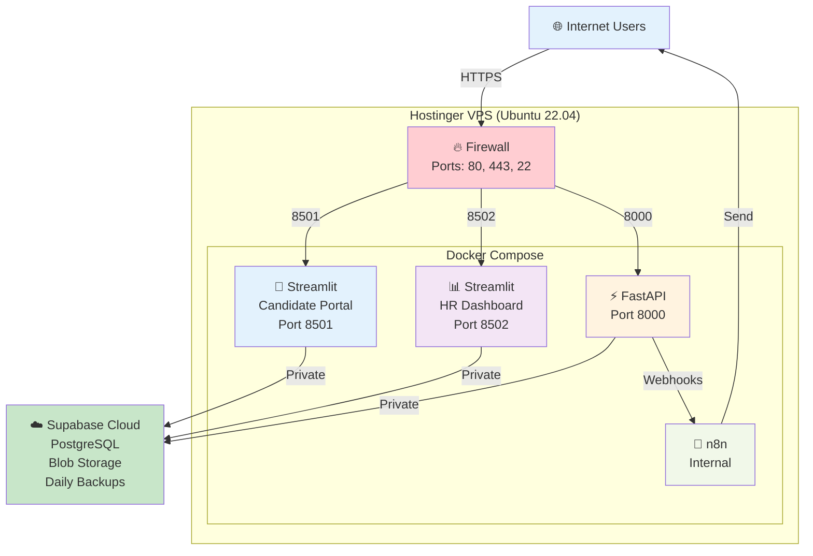

### 10.2 CI/CD Overview (Git/GitHub)

```mermaid
graph LR
    CODE["👨‍💻 Code Commit<br/>GitHub"]
    LINT["🔍 Lint"]
    TEST["✅ Test"]
    BUILD["🔨 Build Docker<br/>Image"]
    REGISTRY["📦 Push to<br/>Registry"]
    DEPLOY["🚀 Deploy<br/>docker-compose up"]
    MIGRATE["🗄️ Alembic<br/>Migrate"]
    SMOKE["🔥 Smoke Tests"]
    PROD["✨ Production"]
    
    CODE -->|Trigger| LINT
    LINT --> TEST
    TEST --> BUILD
    BUILD --> REGISTRY
    REGISTRY --> DEPLOY
    DEPLOY --> MIGRATE
    MIGRATE --> SMOKE
    SMOKE -->|Success| PROD
    
    style CODE fill:#e3f2fd
    style BUILD fill:#fff3e0
    style REGISTRY fill:#f3e5f5
    style DEPLOY fill:#c8e6c9
    style PROD fill:#81c784
```

### 10.3 💾 Backup & DR

| Component | Strategy | RPO/RTO |
|-----------|----------|---------|
| Database | Nightly full + 15-min WAL; retain 30 days | RPO: 15m / RTO: 4h |
| Storage | Versioning + lifecycle rules; cross-region optional | As per cloud provider SLA |
| Drill | Semi-annual restore rehearsal | Tested recovery procedures |

### 10.4 📊 Observability & Monitoring

#### Health Checks
- `/health` endpoint
- `/ready` endpoint
- Container logs with rotation

#### Alarms (Minimal)
- Latency spikes
- 5xx error rate
- Disk usage
- Failed backups

---

## 11. 🔐 Compliance & Data Retention

### 11.1 PII Handling (Personal Identifiable Information)

The system ensures **strict protection of all personally identifiable information (PII)** collected during recruitment and onboarding.

**PII includes:** candidate name, contact details, education, KYC, and interview evaluations.

| Compliance Area | Control Implemented |
|-----------------|---------------------|
| Data Encryption | AES-256 encryption for data at rest (DB + Blob storage), TLS 1.3 for in-transit |
| Access Control | Role-Based Access (RBAC): candidates access only their own data; HR/Admin restricted by scope |
| Masking & Logs | No plain-text PII in logs or exports; sensitive fields masked in error traces |
| Audit Trail | Immutable logs for all create/update/delete actions with timestamp, user, and IP |
| Consent Management | Candidates consent to data usage at Form-1 submission |
| Third-Party Data Sharing | Not applicable (no external integrations in Phase-1) |

### 11.2 📅 Data Retention Policy

| Data Category | Storage | Retention Duration | Notes |
|---------------|---------|-------------------|-------|
| Core Candidate Records | PostgreSQL | 3 years active + 2 years archive | Automatically anonymized after 5 years |
| Documents (KYC, Resume, Certificates) | Supabase Blob Storage | 7 years | Versioned and encrypted |
| Audit Logs & Application History | PostgreSQL (Partitioned Tables) | 10 years | Immutable, used for compliance review |
| Backups (DB + Blob) | Secure Cloud Bucket | 30 days rolling | Daily full backup + WAL every 15 min |

### 11.3 Compliance Alignment

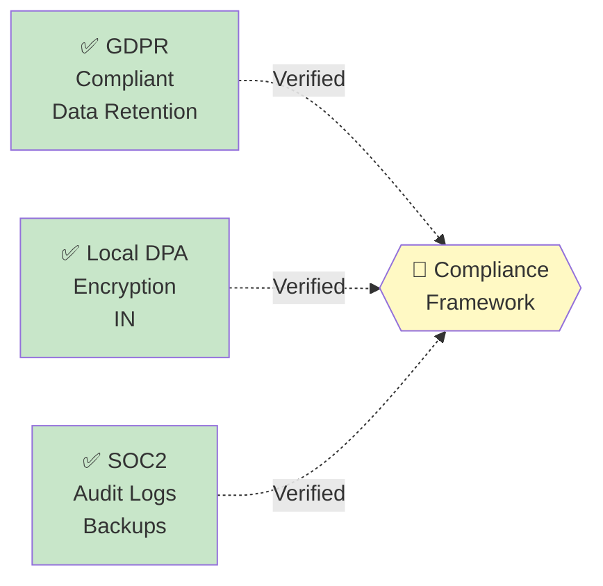

---

## 12. ⚠️ Risks & Mitigations

| Risk ID | Description | Impact | Likelihood | Owner | Mitigation / Action Plan |
|---------|-------------|--------|-----------|-------|--------------------------|
| R-01 | Data breach due to misconfiguration | High | Low | IT & Security | Enforce RBAC, use HTTPS, enable encryption & regular audits |
| R-02 | Server downtime or data loss | High | Medium | Infra/DevOps | Nightly DB backups, redundant Blob storage, DR drills every 6 months |
| R-03 | Unauthorized access by HR staff | Medium | Medium | HR Admin | Role segregation, MFA for HR Manager, activity logging |
| R-04 | Manual Excel uploads may cause data mismatch | Medium | High | HR Ops | Automate import validation and set verification rules |
| R-05 | Candidate duplicate records (mobile/email reuse) | Low | Medium | Backend Dev | Database-level unique constraints, pre-check logic |
| R-06 | Incomplete automation for background verification | Medium | High | HR Head | Manual verification to continue until Phase-2 automation |
| R-07 | Compliance violation (PII retention) | High | Low | Compliance Team | Apply auto-anonymization & annual retention review |
| R-08 | Network failure during onboarding sync | Medium | Low | IT Support | Local retries and queue-based message persistence |

---

## 13. Success Metrics & KPIs

### 13.1 System KPIs

| Parameter | Target | Monitoring Tool |
|-----------|--------|-----------------|
| API Response Time (p95) | < 2 seconds | FastAPI logs / metrics |
| System Uptime | ≥ 99.5% | Hostinger VPS monitoring |
| Data Accuracy | ≥ 99% | Periodic validation reports |
| Backup Success Rate | 100% daily | Backup logs |
| Security Incidents | 0 critical breaches | Audit reports |

### 13.2 💼 Business Outcome KPIs

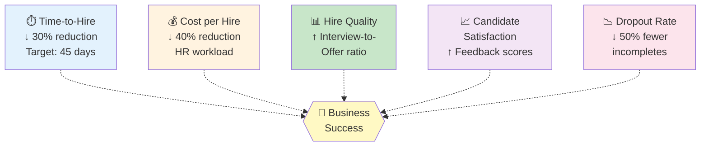

### ✅ Transparency & Auditability
All actions logged & traceable for complete audit trail

### ✅ Compliance Readiness
100% adherence to internal audit checks

---

## 14. 🔄 HR Recruitment Process Flow

### 14.1 🛠️ Pre-requisite

#### 📱 Communication Setup
- Dedicated WhatsApp number
- WhatsApp message plan

#### 📊 Pre-Selection Phase
- Vacancy Identification via MIS data
- Job Post Creation and social media publishing

### 14.2 🧪 Selection Phase - Preliminary Selection

| Step | Action |
|------|--------|
| 1. CV Submission | Candidate sends CV to official WhatsApp number |
| 2. Form-1 Distribution | Automated WhatsApp message sends Form-1 (basic HR details) |
| 3. Form Submission | Candidate fills Form-1 → data stored → confirmation sent |
| 4. Evaluation | Selection criteria evaluated using predefined formula in database |
| 5. Interview Scheduling | HR manually inputs interview date, time, and location |
| 6. Interview Notification | Selected candidates receive WhatsApp + IVR call (R&D) + Chatbot support (R&D) |

### 14.3 🏢 Selection Phase - In-Office Interview

1. **QR Code Scan:** Candidate scans QR code to access test link
   - Previous stage candidates → Form-2
   - Walk-in candidates → Form-1 + Form-2

2. **Evaluation:** Candidate responses assessed

3. **Final Shortlisting:** HR refines selection and fills Form-3 for final shortlisted candidates

### 14.4 🔍 Post-Interview Processing

| Step | Details |
|------|---------|
| Background Verification | Done by HR (automation scope under R&D) |
| Status Update | Verification status updated in database |
| Salary Entry | Salary details entered for shortlisted candidates |
| Data Upload & Offer Letter | Data uploaded to Octane → offer letter generated |
| Communication | ✅ Selected: Offer letter + congratulations via email |
| | ❌ Rejected: Email with remarks |
| Post Data Entry | Candidate fills Form-4 during induction |

---

## Appendix: Complete System Architecture

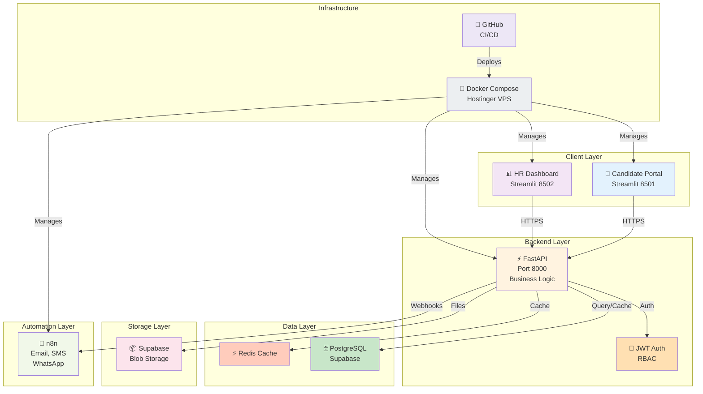

---

**Document End**

**Generated:** 2025-12-30  
**Version:** 2.0  
**Format:** Markdown with Mermaid Diagrams (GitHub-Compatible)
