# AI Call Centre Platform — System Architecture

```mermaid
graph TB
    subgraph EXTERNAL["☁️ External Systems"]
        direction TB
        PSTN["📞 PSTN / Mobile<br/>Networks"]
        EXOTEL["Exotel<br/>(SIP Trunk)"]
        JIO["JIO Cloud<br/>Telephony"]
        OZONE["Ozonetel /<br/>Others"]
        GEMINI["Gemini API<br/>(LLM)"]
        SARVAM_LLM["Sarvam LLM"]
        GOOGLE_STT["Google STT"]
        SARVAM_STT["Sarvam STT"]
        GOOGLE_TTS["Google TTS"]
        SARVAM_TTS["Sarvam TTS"]
        RAZORPAY["Razorpay<br/>(Billing)"]
        DND_REG["DND Registry<br/>(TRAI)"]
    end

    subgraph TELEPHONY_LAYER["📡 Telephony Abstraction Layer (Configurable)"]
        direction TB
        TEL_ADAPTER["Telephony Adapter<br/>(Provider-Agnostic Interface)"]
        SIP_BRIDGE["SIP ↔ WebSocket<br/>Bridge"]
        INBOUND_ROUTER["Inbound Call<br/>Router + IVR"]
        OUTBOUND_ENGINE["Outbound Dialer<br/>Engine"]
        CALL_QUEUE["Call Queue<br/>Manager"]
    end

    subgraph REALTIME_LAYER["🔊 Real-Time Media Layer"]
        direction TB
        LIVEKIT["Self-Hosted LiveKit<br/>Server"]
        TURN["TURN / STUN<br/>Server"]
        AUDIO_BRIDGE["Full-Duplex Audio<br/>Bridge"]
        AUDIO_PROC["Audio Preprocessing<br/>(AGC, Echo Cancel)"]
        NOISE["Noise Cancellation<br/>(RNNoise)"]
    end

    subgraph AI_PIPELINE["🤖 AI Voice Pipeline"]
        direction TB
        VAD["Silero VAD<br/>(Configurable)"]
        STT_LAYER["STT Abstraction<br/>(Google/Sarvam/Custom)"]
        LANGGRAPH["LangGraph<br/>Stateful Orchestrator"]
        LLM_LAYER["LLM Abstraction<br/>(Gemini/Sarvam)"]
        TTS_LAYER["TTS Abstraction<br/>(Google/Sarvam/Custom)"]
        BARGEIN["Barge-In<br/>Handler"]
        PROMPT_ENGINE["Prompt Template<br/>Engine + Versioning"]
        RAG["RAG Pipeline<br/>(Hybrid Search)"]
        EMBEDDING["Embedding Model<br/>(embedding-001)"]
        SENTIMENT["Sentiment Analysis<br/>+ Quality Scoring"]
        TRANSLATION["Real-Time Translation<br/>(Bengali/Hindi/English)"]
    end

    subgraph BACKEND["⚙️ Backend Services"]
        direction TB
        subgraph FASTAPI["FastAPI (Primary API)"]
            CALL_API["Call Management<br/>API"]
            CRM_API["CRM API<br/>(Contacts, Logs)"]
            KB_API["Knowledge Base<br/>API"]
            WS_API["WebSocket API<br/>(Live Transcripts)"]
            AUTH["JWT Auth +<br/>RBAC Middleware"]
            TENANT_MW["Multi-Tenant<br/>Middleware"]
            WEBHOOK["Webhook<br/>Dispatcher"]
            API_GW["API Gateway<br/>(Tenant-Scoped)"]
        end
        subgraph DJANGO["Django (Admin Panel)"]
            TENANT_MGMT["Tenant<br/>Management"]
            AGENT_CONFIG["AI Agent<br/>Configuration"]
            PROMPT_MGMT["Prompt<br/>Management"]
            ANALYTICS_BE["Analytics<br/>Engine"]
            BILLING_SVC["Billing &<br/>Subscription"]
            AUDIT["Audit Logging<br/>Service"]
        end
    end

    subgraph DATA_LAYER["💾 Data Layer (All Self-Hosted & Configurable)"]
        direction TB
        POSTGRES["PostgreSQL / Supabase<br/>(RDBMS - Configurable)<br/>──────────<br/>Tenants, Users, Calls,<br/>CRM, Billing, Audit"]
        QDRANT["Qdrant / pgvector<br/>(Vector DB - Configurable)<br/>──────────<br/>KB Embeddings,<br/>Document Chunks"]
        REDIS["Redis<br/>(Context Memory - Configurable)<br/>──────────<br/>Conversation History,<br/>Session Cache, Pub/Sub"]
        RECORDINGS["Encrypted Call<br/>Recording Storage<br/>(AES-256)"]
    end

    subgraph FRONTEND["🖥️ Frontend Layer"]
        direction TB
        subgraph DISPATCH["Call Dispatch Unit<br/>(HTML/CSS/JS)"]
            LIVE_BOARD["Live Call<br/>Status Board"]
            CALL_TRIGGER["One-Click<br/>Call Trigger"]
            CALL_CTRL["Transfer / Hold /<br/>Conference Controls"]
        end
        subgraph JINJA_HTMX["Jinja2 + HTMX Pages"]
            CRM_UI["CRM Dashboard"]
            KB_UI["Knowledge Base<br/>Manager"]
            TRANSCRIPT_UI["Real-Time Transcript<br/>+ Translation Panel"]
            ANALYTICS_UI["Analytics &<br/>Reporting Dashboard"]
            ONBOARD_UI["Tenant Onboarding<br/>Wizard"]
            CONFIG_UI["Provider Config<br/>Selector UI"]
        end
        ADMIN_UI["Django Admin<br/>Panel UI"]
    end

    subgraph INFRA["🏗️ Infrastructure (Azure)"]
        direction TB
        NGINX["Nginx Reverse<br/>Proxy + SSL"]
        DOCKER["Docker Compose /<br/>Kubernetes"]
        AUTOSCALE["Auto-Scaling<br/>(CPU/Call Volume)"]
        PROMETHEUS["Prometheus +<br/>Grafana"]
        ELK["Log Aggregation<br/>(ELK / Loki)"]
        WAF["WAF + DDoS<br/>Protection"]
    end

    subgraph SECURITY["🔒 Security & Compliance"]
        direction TB
        ENCRYPT["TLS 1.3 + AES-256<br/>Encryption"]
        PII["PII Detection<br/>+ Masking"]
        CONSENT["Call Recording<br/>Consent Manager"]
        TRAI["TRAI / TCCCPR<br/>Compliance"]
        RATE_LIMIT["Rate Limiting<br/>+ Throttling"]
    end

    %% ===== CONNECTIONS =====

    %% External → Telephony
    PSTN --> EXOTEL
    PSTN --> JIO
    PSTN --> OZONE
    EXOTEL --> TEL_ADAPTER
    JIO --> TEL_ADAPTER
    OZONE --> TEL_ADAPTER
    TEL_ADAPTER --> SIP_BRIDGE
    TEL_ADAPTER --> INBOUND_ROUTER
    TEL_ADAPTER --> OUTBOUND_ENGINE
    OUTBOUND_ENGINE --> CALL_QUEUE
    DND_REG -.->|DND Check| OUTBOUND_ENGINE

    %% Telephony → Real-Time
    SIP_BRIDGE <-->|"Audio Stream"| LIVEKIT
    LIVEKIT <--> TURN
    LIVEKIT <-->|"Full Duplex"| AUDIO_BRIDGE
    AUDIO_BRIDGE --> AUDIO_PROC --> NOISE

    %% Real-Time → AI Pipeline
    NOISE --> VAD
    VAD --> STT_LAYER
    VAD --> BARGEIN
    STT_LAYER --> LANGGRAPH
    LANGGRAPH --> LLM_LAYER
    LANGGRAPH --> RAG
    LANGGRAPH --> PROMPT_ENGINE
    RAG --> EMBEDDING
    LLM_LAYER --> TTS_LAYER
    TTS_LAYER --> AUDIO_BRIDGE
    STT_LAYER --> TRANSLATION
    STT_LAYER --> SENTIMENT

    %% AI ↔ External LLM/STT/TTS
    LLM_LAYER -.-> GEMINI
    LLM_LAYER -.-> SARVAM_LLM
    STT_LAYER -.-> GOOGLE_STT
    STT_LAYER -.-> SARVAM_STT
    TTS_LAYER -.-> GOOGLE_TTS
    TTS_LAYER -.-> SARVAM_TTS

    %% Backend connections
    LANGGRAPH --> CALL_API
    CALL_API --> CRM_API
    TRANSLATION --> WS_API
    SENTIMENT --> ANALYTICS_BE
    BILLING_SVC -.-> RAZORPAY

    %% Data connections
    CRM_API --> POSTGRES
    KB_API --> QDRANT
    EMBEDDING --> QDRANT
    LANGGRAPH --> REDIS
    CALL_API --> RECORDINGS
    AUDIT --> POSTGRES
    BILLING_SVC --> POSTGRES
    ANALYTICS_BE --> POSTGRES

    %% Frontend → Backend
    DISPATCH -->|"WebSocket"| WS_API
    DISPATCH -->|"REST"| CALL_API
    JINJA_HTMX --> FASTAPI
    ADMIN_UI --> DJANGO
    CONFIG_UI --> AGENT_CONFIG

    %% Infrastructure
    NGINX --> FASTAPI
    NGINX --> DJANGO
    NGINX --> LIVEKIT
    DOCKER --> BACKEND
    DOCKER --> DATA_LAYER
    DOCKER --> REALTIME_LAYER
    PROMETHEUS --> DOCKER
    WAF --> NGINX

    %% Security
    ENCRYPT -.-> DATA_LAYER
    PII -.-> AI_PIPELINE
    CONSENT -.-> TELEPHONY_LAYER
    TRAI -.-> OUTBOUND_ENGINE
    RATE_LIMIT -.-> API_GW

    %% Styling
    classDef external fill:#FFF3E0,stroke:#E65100,stroke-width:2px,color:#000
    classDef telephony fill:#E3F2FD,stroke:#1565C0,stroke-width:2px,color:#000
    classDef realtime fill:#F3E5F5,stroke:#7B1FA2,stroke-width:2px,color:#000
    classDef ai fill:#E8F5E9,stroke:#2E7D32,stroke-width:2px,color:#000
    classDef backend fill:#FFF8E1,stroke:#F9A825,stroke-width:2px,color:#000
    classDef data fill:#ECEFF1,stroke:#37474F,stroke-width:2px,color:#000
    classDef frontend fill:#E1F5FE,stroke:#0277BD,stroke-width:2px,color:#000
    classDef infra fill:#FCE4EC,stroke:#C62828,stroke-width:2px,color:#000
    classDef security fill:#FFEBEE,stroke:#B71C1C,stroke-width:2px,color:#000

    class PSTN,EXOTEL,JIO,OZONE,GEMINI,SARVAM_LLM,GOOGLE_STT,SARVAM_STT,GOOGLE_TTS,SARVAM_TTS,RAZORPAY,DND_REG external
    class TEL_ADAPTER,SIP_BRIDGE,INBOUND_ROUTER,OUTBOUND_ENGINE,CALL_QUEUE telephony
    class LIVEKIT,TURN,AUDIO_BRIDGE,AUDIO_PROC,NOISE realtime
    class VAD,STT_LAYER,LANGGRAPH,LLM_LAYER,TTS_LAYER,BARGEIN,PROMPT_ENGINE,RAG,EMBEDDING,SENTIMENT,TRANSLATION ai
    class CALL_API,CRM_API,KB_API,WS_API,AUTH,TENANT_MW,WEBHOOK,API_GW,TENANT_MGMT,AGENT_CONFIG,PROMPT_MGMT,ANALYTICS_BE,BILLING_SVC,AUDIT backend
    class POSTGRES,QDRANT,REDIS,RECORDINGS data
    class LIVE_BOARD,CALL_TRIGGER,CALL_CTRL,CRM_UI,KB_UI,TRANSCRIPT_UI,ANALYTICS_UI,ONBOARD_UI,CONFIG_UI,ADMIN_UI frontend
    class NGINX,DOCKER,AUTOSCALE,PROMETHEUS,ELK,WAF infra
    class ENCRYPT,PII,CONSENT,TRAI,RATE_LIMIT security
```

## Architecture Overview

### Layer Summary

| Layer | Technology | Purpose |
|-------|-----------|---------|
| **Telephony** | Exotel / JIO / Ozonetel (Configurable) | PSTN connectivity via SIP trunking |
| **Real-Time Media** | Self-Hosted LiveKit + TURN/STUN | Full-duplex audio streaming |
| **AI Voice Pipeline** | LangGraph + Silero VAD + Configurable STT/TTS/LLM | Stateful conversational AI |
| **Backend** | FastAPI (API) + Django (Admin) | Business logic, CRM, auth |
| **Data** | PostgreSQL + Qdrant + Redis (All configurable) | RDBMS, vector search, context memory |
| **Frontend** | HTML/CSS/JS (Dispatch) + Jinja2/HTMX (Pages) | Operator UI, dashboards |
| **Infrastructure** | Azure + Docker + Nginx + Prometheus | Deployment, scaling, monitoring |
| **Security** | TLS 1.3, AES-256, PII masking, TRAI compliance | End-to-end security |

### Key Design Principles

1. **Provider Agnostic**: Every external service (LLM, STT, TTS, Telephony, DB) uses an abstraction layer making providers swappable via configuration
2. **Multi-Tenant**: Schema-level data isolation, per-tenant billing, white-label branding
3. **Full Duplex**: Simultaneous bidirectional audio via LiveKit with proper barge-in handling
4. **Low Latency**: Target <500ms first-byte response through streaming pipelines + caching
5. **Self-Hosted First**: LiveKit, PostgreSQL, Qdrant, Redis all self-hosted for data sovereignty
