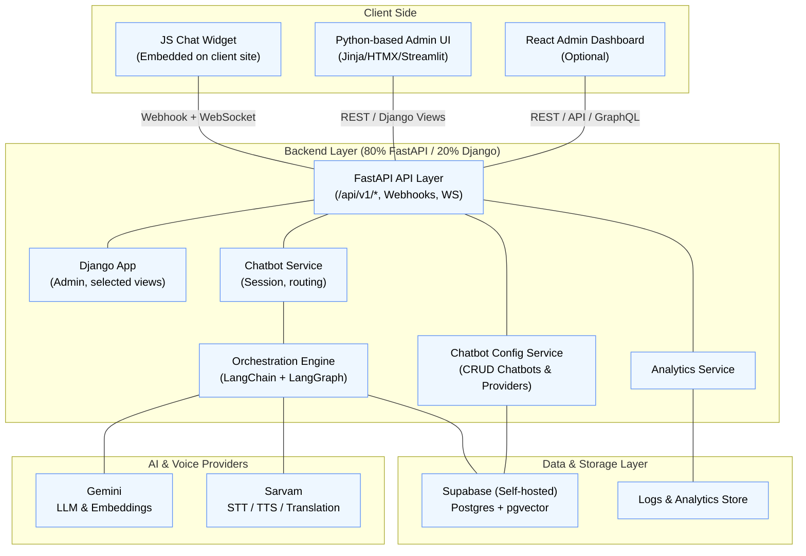
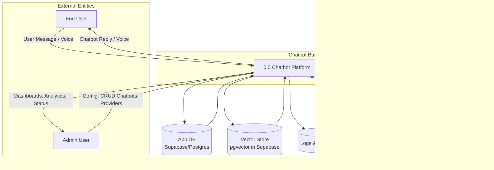
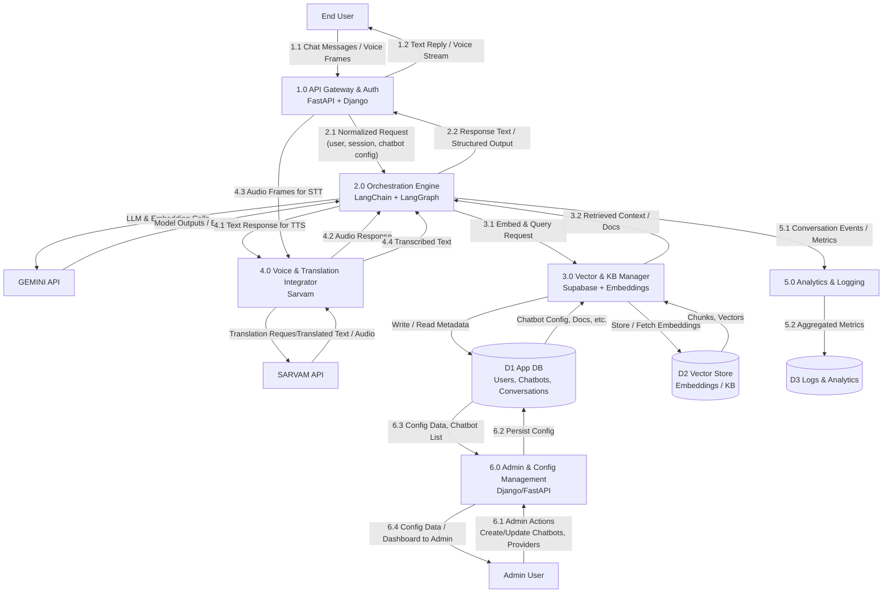

# Chatbot Builder Platform 

## 1. System Overview

This document describes the **current demo / PoC architecture** of the Chatbot Builder Platform with the following technical baseline:

- **Backend**
  - **80% FastAPI** – primary API layer, orchestration endpoints, webhooks, chat APIs.
  - **20% Django** – selected use-cases: admin/config UI, some server-rendered pages, optional built-in auth/admin.
- **Frontend**
  - Python-based frontends (e.g. Jinja2/HTMX, Streamlit, etc.) for internal tools.
  - Optional **React-based admin dashboard** and **JS chat widget** embedded into client sites.
- **AI & Orchestration**
  - **Gemini** – main LLM + embedding generator.
  - **Sarvam** – STT, TTS, translation (demo/testing).
  - **LangChain + LangGraph** – orchestration of RAG, tools, and conversation flows.
  - **Self-hosted Supabase (Postgres + pgvector)** – vector database for knowledge base.
- **Integration**
  - A **webhook endpoint** (FastAPI) is generated per chatbot and used by the **chat widget** to send/receive messages.

---

## 2. High-Level Architecture Blueprint

### 2.1 Component View



### 2.2 Overall Flow Chart – Text & Voice Request

```mermaid
flowchart TD
    classDef step fill:#eef7ff,stroke:#5b8ff6,stroke-width:1px,color:#000
    classDef decision fill:#fff7e6,stroke:#ffa940,stroke-width:1px,color:#000
    classDef ext fill:#ffe7ba,stroke:#d46b08,stroke-width:1px,color:#000
    classDef data fill:#f6ffed,stroke:#73d13d,stroke-width:1px,color:#000

    U[User]:::ext --> W["Client Chat Widget (Web / App)"]:::step

    W --> T1{"Input Type?"}:::decision

    %% TEXT PATH
    T1 -->|Text| T_API["FastAPI Chat/Webhook Endpoint (/api/v1/chat or /webhook)"]:::step
    T_API --> T_VAL["Validate chatbot_id, auth, load chatbot config"]:::step

    T_VAL --> T_OK{"Valid & Active Chatbot?"}:::decision
    T_OK -->|No| T_ERR["Return error (invalid / disabled chatbot)"]:::step
    T_ERR --> T_END_TEXT["Render error in widget"]:::step

    T_OK -->|Yes| T_STATE["Build conversation state (session, history, config)"]:::step
    T_STATE --> T_GRAPH["Invoke LangGraph flow (standard_graph)"]:::step

    T_GRAPH --> T_RAG{"Need KB / RAG?"}:::decision
    T_RAG -->|Yes| T_VEC_REQ["Embed / Query via LangChain (Gemini embeddings → Supabase)"]:::step
    T_VEC_REQ --> T_VEC_DB["Supabase pgvector (retrieve chunks)"]:::data
    T_VEC_DB --> T_CTX["Return context to graph"]:::step

    T_RAG -->|No| T_DIRECT["Skip RAG – direct LLM call"]:::step

    T_CTX --> T_LLM
    T_DIRECT --> T_LLM

    T_LLM["Call Gemini LLM (prompt + context)"]:::step
    T_LLM --> T_POST["Post-process response (formatting, safety, truncation)"]:::step
    T_POST --> T_LOG["Log conversation & metrics (Analytics Service / DB)"]:::step
    T_LOG --> T_RESP["Return JSON response (text reply)"]:::step
    T_RESP --> T_WIDGET["Widget renders reply (chat bubble)"]:::step

    %% VOICE PATH
    T1 -->|Voice| V_WS["WebSocket connection (audio stream)"]:::step
    V_WS --> V_STT["Stream audio to Sarvam STT (speech → text)"]:::step
    V_STT --> V_TXT["Transcribed text (normalized message)"]:::step

    %% Voice uses same FastAPI text pipeline
    V_TXT --> T_API

    %% OPTIONAL TTS RETURN
    T_POST --> V_TTS_DEC{"Voice reply needed?"}:::decision
    V_TTS_DEC -->|No| T_LOG
    V_TTS_DEC -->|Yes| V_TTS["Call Sarvam TTS (text → audio)"]:::step
    V_TTS --> V_STREAM["Stream audio back via WebSocket"]:::step
    V_STREAM --> V_PLAY["Widget plays audio reply"]:::step
```



### 2.3 DFD 

#### 2.3.1 DFD Level-0



#### 2.3.2 DFD Level-1



# Chatbot Platform – Project Structure

```text
chatbot-platform/
├── backend/
│   ├── app/
│   │   ├── __init__.py
│   │   ├── main.py                    # FastAPI application entry
│   │   ├── config.py                  # Settings & environment config
│   │   │
│   │   ├── api/                       # API endpoints
│   │   │   ├── __init__.py
│   │   │   ├── deps.py                # Dependency injection
│   │   │   └── v1/
│   │   │       ├── auth.py            # Authentication endpoints
│   │   │       ├── chatbots.py        # Chatbot CRUD
│   │   │       ├── chat.py            # Chat endpoints
│   │   │       ├── webhooks.py        # Webhook management
│   │   │       ├── analytics.py       # Analytics & reporting
│   │   │       └── providers.py       # Provider configuration
│   │   │
│   │   ├── models/                    # SQLAlchemy ORM models
│   │   │   ├── user.py
│   │   │   ├── chatbot.py
│   │   │   ├── conversation.py
│   │   │   ├── webhook.py
│   │   │   └── analytics.py
│   │   │
│   │   ├── schemas/                   # Pydantic schemas
│   │   │   ├── user.py
│   │   │   ├── chatbot.py
│   │   │   ├── chat.py
│   │   │   └── provider.py
│   │   │
│   │   ├── services/                  # Business logic layer
│   │   │   ├── chatbot_service.py     # Core chatbot logic
│   │   │   ├── webhook_service.py     # Webhook generation
│   │   │   ├── session_service.py     # Session management
│   │   │   ├── analytics_service.py   # Analytics processing
│   │   │   └── billing_service.py     # Usage & cost tracking
│   │   │
│   │   ├── providers/                 # 🔌 Provider Abstraction Layer
│   │   │   ├── __init__.py
│   │   │   ├── base.py                # Abstract base classes
│   │   │   ├── factory.py             # Factory & Registry pattern
│   │   │   │
│   │   │   ├── llm/                   # LLM providers
│   │   │   │   ├── openai_provider.py
│   │   │   │   ├── anthropic_provider.py
│   │   │   │   ├── cohere_provider.py
│   │   │   │   └── ollama_provider.py
│   │   │   │
│   │   │   ├── vector_db/             # Vector database providers
│   │   │   │   ├── qdrant_provider.py
│   │   │   │   ├── pinecone_provider.py
│   │   │   │   └── weaviate_provider.py
│   │   │   │
│   │   │   ├── stt/                   # Speech-to-Text providers
│   │   │   │   ├── sarvam_provider.py
│   │   │   │   ├── whisper_provider.py
│   │   │   │   └── deepgram_provider.py
│   │   │   │
│   │   │   ├── tts/                   # Text-to-Speech providers
│   │   │   │   ├── sarvam_provider.py
│   │   │   │   ├── elevenlabs_provider.py
│   │   │   │   └── openai_tts_provider.py
│   │   │   │
│   │   │   ├── translation/           # Translation providers
│   │   │   │   ├── sarvam_provider.py
│   │   │   │   ├── google_provider.py
│   │   │   │   └── deepl_provider.py
│   │   │   │
│   │   │   ├── ocr/                   # OCR providers
│   │   │   │   ├── tesseract_provider.py
│   │   │   │   └── google_vision_provider.py
│   │   │   │
│   │   │   └── image/                 # Image processing
│   │   │       ├── opencv_provider.py
│   │   │       └── vision_llm_provider.py
│   │   │
│   │   ├── orchestration/             # LangChain / LangGraph orchestration
│   │   │   ├── __init__.py
│   │   │   ├── base_state.py          # Shared conversation state
│   │   │   ├── common_tools.py        # Tools exposed to graphs
│   │   │   ├── standard_graph.py      # Default text-chat graph
│   │   │   ├── voice_graph.py         # Voice pipeline graph (STT → LLM → TTS)
│   │   │   └── supervisor_graph.py    # Routing / multi-agent supervisor
│   │   │
│   │   ├── websocket/                 # WebSocket handlers
│   │   │   ├── connection_manager.py  # Connection pool management
│   │   │   ├── voice_chat_handler.py  # Real-time voice streaming
│   │   │   └── chat_handler.py        # Text chat streaming
│   │   │
│   │   ├── core/                      # Core utilities
│   │   │   ├── security.py            # JWT, encryption
│   │   │   ├── cache.py               # Redis caching utilities
│   │   │   ├── exceptions.py          # Custom exceptions
│   │   │   └── logging.py             # Logging configuration
│   │   │
│   │   ├── db/                        # Database configuration
│   │   │   ├── session.py             # Database session
│   │   │   └── base.py                # Base model
│   │   │
│   │   └── tasks/                     # Celery background tasks
│   │       ├── celery_app.py          # Celery configuration
│   │       ├── document_processing.py # Document embedding (LangChain)
│   │       ├── analytics.py           # Analytics aggregation
│   │       └── cleanup.py             # Maintenance tasks
│   │
│   ├── alembic/                       # Database migrations
│   │   ├── versions/
│   │   └── env.py
│   │
│   ├── tests/                         # Test suite
│   │   ├── unit/
│   │   ├── integration/
│   │   └── e2e/
│   │
│   ├── requirements.txt               # Python deps (FastAPI, Django, LangChain, LangGraph, etc.)
│   ├── Dockerfile                     # Backend container
│   └── docker-compose.yml             # Local backend-only dev setup
│
├── frontend/
│   ├── admin-dashboard/               # React admin application
│   │   ├── src/
│   │   │   ├── components/
│   │   │   ├── pages/
│   │   │   ├── hooks/
│   │   │   ├── services/
│   │   │   └── main.tsx
│   │   ├── package.json
│   │   └── Dockerfile
│   │
│   └── chat-widget/                   # Embeddable widget
│       ├── src/
│       │   ├── widget.js              # Main widget code
│       │   └── styles.css
│       ├── package.json
│       └── dist/                      # Built widget files
│
├── k8s/                               # Kubernetes manifests
│   ├── namespace.yaml
│   ├── backend-deployment.yaml
│   ├── frontend-deployment.yaml
│   ├── redis-deployment.yaml
│   ├── postgres-deployment.yaml
│   ├── ingress.yaml
│   └── configmap.yaml
│
├── scripts/                           # Utility scripts
│   ├── init_db.py                     # Database initialization
│   ├── seed_data.py                   # Sample data
│   └── backup.sh                      # Backup script
│
├── docs/                              # Documentation
│   ├── api.md                         # API documentation
│   ├── providers.md                   # Provider integration guide
│   ├── deployment.md                  # Deployment guide
│   └── architecture.md                # Architecture details
│
├── .env.example                       # Environment variables template
├── .gitignore
├── docker-compose.yml                 # Full stack composition (backend + frontend + DB + Redis)
├── docker-compose.prod.yml            # Production composition
├── Makefile                           # Common commands
└── README.md                          # Project overview


