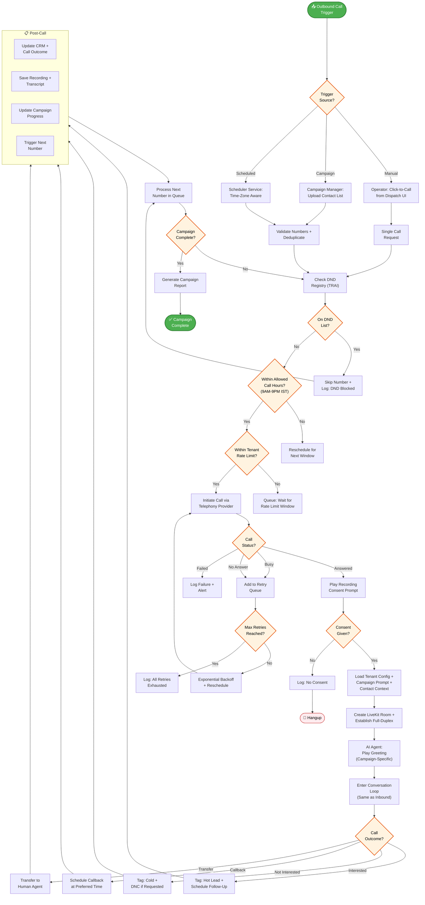
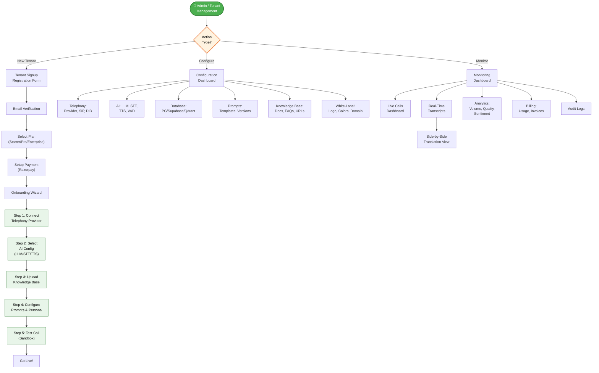
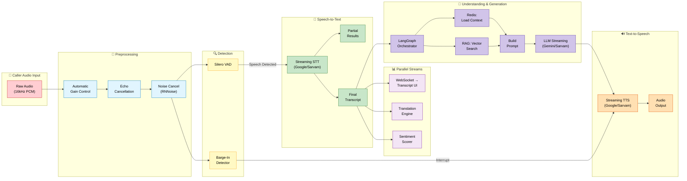

# AI Call Centre Platform — Process Flow Diagrams

## 1. Inbound Call Flow

```mermaid
flowchart TD
    START_IN(["📞 Incoming Call<br/>(PSTN / SIP)"])
    
    START_IN --> TEL_RECV["Telephony Provider<br/>(Exotel/JIO/Ozonetel)<br/>Receives Call"]
    TEL_RECV --> CONSENT{"Recording Consent<br/>Prompt Played?"}
    CONSENT -->|"Accepted"| DID_MAP["DID Number →<br/>Tenant Mapping"]
    CONSENT -->|"Declined"| LOG_DECLINE["Log: Consent Declined"]
    LOG_DECLINE --> DISCONNECT_1(["🔴 Disconnect"])
    
    DID_MAP --> TENANT_LOOKUP["Load Tenant Config<br/>(LLM, STT, TTS,<br/>Prompts, KB)"]
    TENANT_LOOKUP --> IVR_CHECK{"IVR Menu<br/>Configured?"}
    
    IVR_CHECK -->|"Yes"| IVR["Play IVR Menu<br/>Collect DTMF Input"]
    IVR_CHECK -->|"No"| LIVEKIT_ROOM["Create LiveKit Room<br/>+ Join Audio Tracks"]
    IVR --> ROUTE_DECISION{"Route To?"}
    ROUTE_DECISION -->|"AI Agent"| LIVEKIT_ROOM
    ROUTE_DECISION -->|"Human Agent"| HUMAN_QUEUE["Queue for<br/>Human Agent"]
    ROUTE_DECISION -->|"Voicemail"| VOICEMAIL["Record<br/>Voicemail"]
    VOICEMAIL --> SAVE_VM["Save to Storage +<br/>Transcribe"] --> END_VM(["🔴 End Call"])
    
    HUMAN_QUEUE --> HUMAN_AVAIL{"Agent<br/>Available?"}
    HUMAN_AVAIL -->|"Yes"| CONNECT_HUMAN["Connect to<br/>Human Agent"]
    HUMAN_AVAIL -->|"No"| FALLBACK_AI["Route to<br/>AI Agent"]
    FALLBACK_AI --> LIVEKIT_ROOM
    
    LIVEKIT_ROOM --> AUDIO_STREAM["Full-Duplex Audio<br/>Stream Established"]
    AUDIO_STREAM --> NOISE_CANCEL["Noise Cancellation<br/>(RNNoise)"]
    NOISE_CANCEL --> AUDIO_PREPROC["Audio Preprocessing<br/>(AGC + Echo Cancel)"]
    
    AUDIO_PREPROC --> CONVERSATION_LOOP

    subgraph CONVERSATION_LOOP["🔄 Conversation Loop (Real-Time)"]
        direction TB
        VAD_DETECT["Silero VAD<br/>Detects Speech"]
        VAD_DETECT --> STT_PROCESS["STT: Speech → Text<br/>(Google/Sarvam)"]
        STT_PROCESS --> BARGE_CHECK{"Barge-In<br/>Detected?"}
        BARGE_CHECK -->|"Yes"| STOP_TTS["Stop Current TTS<br/>Playback"] --> LANGGRAPH_PROC
        BARGE_CHECK -->|"No"| LANGGRAPH_PROC
        
        LANGGRAPH_PROC["LangGraph<br/>State Machine"]
        LANGGRAPH_PROC --> CONTEXT_LOAD["Load Context<br/>from Redis"]
        CONTEXT_LOAD --> NEED_KB{"Needs Knowledge<br/>Base Lookup?"}
        NEED_KB -->|"Yes"| RAG_SEARCH["RAG: Embed Query →<br/>Vector Search (Qdrant)"]
        RAG_SEARCH --> LLM_PROMPT
        NEED_KB -->|"No"| LLM_PROMPT
        
        LLM_PROMPT["Compose Prompt<br/>(System + Context +<br/>RAG + User Input)"]
        LLM_PROMPT --> LLM_CALL["LLM Generate Response<br/>(Gemini/Sarvam)<br/>Streaming"]
        LLM_CALL --> TOOL_CHECK{"Tool Call<br/>Required?"}
        TOOL_CHECK -->|"CRM Lookup"| CRM_TOOL["Fetch CRM Data"] --> LLM_CALL
        TOOL_CHECK -->|"Transfer"| TRANSFER["Transfer to<br/>Human/Dept"]
        TOOL_CHECK -->|"No"| TTS_PROCESS
        
        TTS_PROCESS["TTS: Text → Speech<br/>(Google/Sarvam)<br/>Streaming"]
        TTS_PROCESS --> PLAY_AUDIO["Stream Audio to<br/>Caller via LiveKit"]
        PLAY_AUDIO --> SAVE_CONTEXT["Save Turn to<br/>Redis Context"]
    end
    
    CONNECT_HUMAN --> LIVE_MONITOR["Admin: Live Transcript<br/>+ Translation View"]

    CONVERSATION_LOOP --> PARALLEL_OPS

    subgraph PARALLEL_OPS["⚡ Parallel Operations (During Call)"]
        direction LR
        TRANSCRIBE_LIVE["Stream Transcript<br/>via WebSocket"]
        TRANSLATE_LIVE["Real-Time Translation<br/>(Bengali↔Hindi↔English)"]
        SENTIMENT_LIVE["Sentiment Analysis<br/>Per Utterance"]
        CRM_UPDATE["Update CRM:<br/>Call Log + Notes"]
    end
    
    PARALLEL_OPS --> CALL_END{"Call Ends?"}
    CALL_END -->|"No"| CONVERSATION_LOOP
    CALL_END -->|"Yes"| POST_CALL

    subgraph POST_CALL["📋 Post-Call Processing"]
        direction TB
        SAVE_RECORDING["Encrypt & Save<br/>Call Recording<br/>(AES-256)"]
        FINAL_TRANSCRIPT["Finalize<br/>Transcript"]
        QUALITY_SCORE["Generate Call<br/>Quality Score"]
        CRM_FINAL["Update CRM:<br/>Outcome, Tags,<br/>Follow-up"]
        ANALYTICS_UPDATE["Update Analytics<br/>Dashboards"]
    end
    
    POST_CALL --> END_IN(["✅ Call Complete"])

    %% Styling
    classDef startEnd fill:#4CAF50,stroke:#2E7D32,color:#FFF,stroke-width:2px
    classDef process fill:#E3F2FD,stroke:#1565C0,color:#000,stroke-width:1px
    classDef decision fill:#FFF3E0,stroke:#E65100,color:#000,stroke-width:2px
    classDef ai fill:#E8F5E9,stroke:#2E7D32,color:#000,stroke-width:1px
    classDef danger fill:#FFEBEE,stroke:#C62828,color:#000,stroke-width:1px
    classDef parallel fill:#F3E5F5,stroke:#7B1FA2,color:#000,stroke-width:1px

    class START_IN,END_IN,END_VM startEnd
    class DISCONNECT_1 danger
    class CONSENT,IVR_CHECK,ROUTE_DECISION,HUMAN_AVAIL,BARGE_CHECK,NEED_KB,TOOL_CHECK,CALL_END decision
    class VAD_DETECT,STT_PROCESS,LANGGRAPH_PROC,LLM_CALL,TTS_PROCESS,RAG_SEARCH,LLM_PROMPT ai
    class TRANSCRIBE_LIVE,TRANSLATE_LIVE,SENTIMENT_LIVE,CRM_UPDATE parallel
```

---

## 2. Outbound Call Flow

---

## 3. Admin & Tenant Onboarding Flow

---

## 4. Real-Time Voice AI Pipeline (Detail)

---

## Latency Budget

| Stage | Target Latency | Notes |
|-------|---------------|-------|
| Audio Preprocessing + VAD | <50ms | Local processing |
| STT (Streaming) | <150ms | First partial result |
| LangGraph + RAG | <100ms | Redis cache + Qdrant |
| LLM (First Token) | <200ms | Streaming mode |
| TTS (First Chunk) | <100ms | Streaming synthesis |
| **Total First-Byte** | **<500ms** | **End-to-end target** |
