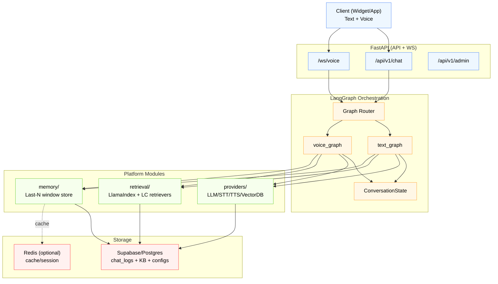
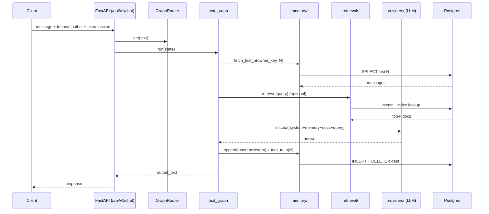

# Chatbot Platform Repo Architecture (LangChain + LangGraph + LlamaIndex)

This document explains the **overall folder structure**, **code architecture**, and **engineering guidelines** for the Chatbot Platform repository (multi-tenant, pluggable providers, text + voice, RAG, and sliding-window memory).

> Goal: Keep the system **enterprise maintainable** — predictable orchestration (LangGraph), modular integrations (providers), swappable retrieval (LlamaIndex/LangChain), and consistent memory (last **N** turns per user/session/thread).

---

## 1. Big Picture: How the System Works

### 1.1 Runtime Request Types
- **Text Chat (HTTP)**: Client → FastAPI `/api/v1/chat` → LangGraph `text_graph` → response
- **Voice Chat (WebSocket)**: Client → FastAPI `/ws/voice` → streaming loop (STT chunks) → LangGraph `voice_graph` → optional TTS stream back

### 1.2 Core Building Blocks
- **FastAPI**: API gateway + auth + tenant routing + WS channel
- **LangGraph**: deterministic orchestration (state machine)
- **LangChain**: tool wrappers/integrations (LLMs, tool calling, helpers)
- **LlamaIndex**: retrieval subsystem (indexing + query engine)
- **Providers layer**: unified interface for LLM/STT/TTS/VectorDB
- **Memory layer**: store last N messages (user/session scoped) + trimming logic
- **Data layer**: Supabase/Postgres + optional Redis cache

---

## 2. High-Level Architecture Diagram



---

## 3. Repo Folder Structure (Conceptual)

At the top-level:

```text
chatbot-platform/
├── backend/          # FastAPI + LangGraph + providers + retrieval + memory
├── frontend/         # Admin UI + widget + optional dashboards
├── docs/             # Architecture, API docs, SOPs
├── docker-compose.yml
├── docker-compose.prod.yml
├── .env.example
└── README.md
```

---

## 4. Backend Architecture (Detailed)

### 4.1 `backend/app/` Overview

```text
backend/app/
├── main.py                 # FastAPI entrypoint
├── config.py               # settings (env vars, feature flags)
├── api/                    # REST + WS endpoints
├── db/                     # SQLAlchemy / DB models / sessions
├── providers/              # LLM/STT/TTS/VectorDB abstraction
├── orchestration/          # LangGraph brain (graphs + state)
├── retrieval/              # LlamaIndex + LangChain retrievers + ingestion
├── memory/                 # last-N context window per user/session
├── websocket/              # WS handlers + session managers
├── services/               # business services (thin orchestration support)
├── core/                   # common utilities (logging/security/cache)
└── tasks/                  # background jobs (index build, embedding, cleanup)
```

---

## 5. Folder-by-Folder: Responsibilities & Boundaries

### 5.1 `api/` — Transport Layer (HTTP + WebSocket)
**Purpose:** request validation, auth, tenant resolution, calling the right service/graph.

**Rules:**
- ✅ Keep endpoints thin
- ✅ No provider-specific logic
- ✅ No direct retrieval/memory SQL inside routes

**Typical flow for `/api/v1/chat`:**
1. Resolve tenant + chatbot + owner_key (user/session/thread)
2. Build initial `ConversationState`
3. Call `GraphRouter.get("text")` and execute compiled graph
4. Return final response

---

### 5.2 `orchestration/` — LangGraph Brain
**Purpose:** deterministic orchestration only (graphs, state, policies).

**Contains:**
- `state.py` → shared state model
- `text_graph.py` → text flow
- `voice_graph.py` → voice flow (wait vs proceed)
- `policies.py` → routing rules (rag_policy, tts_policy)
- `tools.py` → **thin adapters** calling `memory/`, `retrieval/`, `providers/`
- `graph_router.py` → choose which graph to run

**Golden Rule:**  
`orchestration/` should *not* know whether retrieval is LlamaIndex or LangChain. It just calls a `retrieve_docs()` adapter.

---

### 5.3 `providers/` — External Integrations Layer
**Purpose:** unify how the platform calls external services:
- LLM: Gemini/OpenAI/Claude/Ollama
- Vector DB: Supabase pgvector/Pinecone/etc.
- STT/TTS: Sarvam/Whisper/Coqui/etc.

**Key files:**
- `base.py` → abstract interfaces
- `registry.py` → name → class mapping
- `factory.py` → tenant/bot-aware resolution of provider config

**Rule:** providers are stateless wrappers; state belongs to LangGraph.

---

### 5.4 `retrieval/` — Knowledge + RAG Subsystem
**Purpose:** retrieval is a subsystem, not a node. It includes:
- ingestion pipelines
- chunking
- indexing
- query-time retrieval + rerank + dedupe

**Why separate from orchestration?**
Because retrieval evolves fast and changes frequently (hybrid retrieval, rerankers, metadata filtering). Orchestration should remain stable.

---

### 5.5 `memory/` — Sliding Window Context (Last N Turns)
**Purpose:** store and serve the last **N** messages per:
- `owner_type`: user / session
- `owner_id`
- `thread_id`
- `tenant_id`
- `chatbot_id`

**Core operations:**
- `fetch_last_n(owner_key, n)`
- `append(owner_key, message)`
- `trim_to_n(owner_key, n)` (delete oldest)

**Rule:** memory policy belongs here (N per tenant/bot plan), not in graphs.

---

### 5.6 `services/` — Business Services
**Purpose:** business logic that sits between API and modules:
- tenant limits
- plan gating
- feature flags
- provider config CRUD
- retrieval config CRUD
- memory config CRUD

**Rule:** services may call DB + modules, but should not implement orchestration itself.

---

### 5.7 `db/` — Database Layer
**Purpose:** schemas + models + sessions.

**Minimum recommended fields for chat logs:**
- tenant_id, chatbot_id
- owner_type, owner_id
- thread_id
- role (user/assistant)
- seq (monotonic ordering) or created_at indexed
- content

This makes **last-N window** fast and reliable.

---

### 5.8 `websocket/` — Realtime Voice Plumbing
**Purpose:** WS connection manager + voice session state bridging.

**Rule:** WS code handles streaming and timing; LangGraph handles reasoning.

---

### 5.9 `tasks/` — Background Jobs
**Purpose:** async jobs where latency doesn't matter:
- build indexes
- embed docs
- cleanup old logs
- backfill KB

---

## 6. Text + Voice Execution Flows

### 6.1 Text Chat Flow


### 6.2 Voice Chat Flow (Streaming)
```mermaid
flowchart TD
  A[WS audio chunk] --> B[STT provider]
  B --> C{turn_ready?}
  C -- No --> A
  C -- Yes --> D[Load memory window]
  D --> E[Optional retrieval (RAG)]
  E --> F[LLM generate]
  F --> G{TTS enabled?}
  G -- Yes --> H[TTS provider stream]
  H --> I[WS audio out]
  G -- No --> J[WS text out]
  F --> K[Persist + trim last N]
```

---

## 7. Engineering Guidelines (Non-Negotiables)

### 7.1 Dependency Direction (Avoid Circular Imports)
**Allowed imports (one-way):**
- `api/` → `services/` → (`memory/`, `retrieval/`, `providers/`, `db/`)
- `orchestration/` → `tools.py` → (`memory/`, `retrieval/`, `providers/`)
- `providers/` should NOT import `orchestration/`
- `retrieval/` should NOT import `orchestration/`
- `memory/` should NOT import `orchestration/`

> Orchestration consumes modules; modules should not consume orchestration.

### 7.2 Keep Orchestration Thin
- Graphs define **what happens when**
- Nodes call adapters, not DB directly
- Policies are pure functions

### 7.3 Provider Abstraction Rules
- One base interface per provider type
- Registry maps string keys → provider classes
- Factory loads tenant/bot configuration and returns a configured provider instance

### 7.4 Memory Rules (Last N Turns)
- Always key by **owner_key** (user/session + thread)
- Always trim after persisting
- Index DB for fast retrieval (`tenant_id, owner_type, owner_id, thread_id, seq desc`)

### 7.5 Retrieval Rules (LlamaIndex)
- Ingestion is separate from query-time retrieval
- Always attach metadata (tenant_id, chatbot_id, doc_id, chunk_id)
- Prefer deterministic chunking settings per bot

### 7.6 Logging & Observability
- Log per request:
  - tenant_id, chatbot_id, owner_key
  - latency per stage (STT, retrieval, LLM, TTS)
  - token usage (where available)
- Never log secrets (use Vault / env indirection)

---

## 8. Recommended Documentation Set (docs/)

```text
docs/
├── architecture.md                 # overall platform view
├── combined-architecture.md        # your legacy/master architecture
├── langgraph-architecture.md       # orchestration deep dive
├── retrieval-llamaindex.md         # ingestion + query engine + rerank
├── memory-window.md                # last N memory rules + schema
├── api.md                          # endpoints, payloads, auth
└── deployment.md                   # docker/VM setup + ops checklist
```

---

## 9. Quick Checklist for New Developers

- [ ] Understand `OwnerKey` (user vs session) and `thread_id`
- [ ] Know where code goes:
  - new flow logic → `orchestration/`
  - new external service → `providers/`
  - new RAG technique → `retrieval/`
  - new memory behavior → `memory/`
- [ ] Never query DB directly inside graph nodes (use adapters/services)
- [ ] Always enforce memory trim after writing new turn
- [ ] Keep all tenant-specific behavior behind configs

---

## 10. Next Implementation Steps (Practical)

1. Implement real `memory/manager.py` and wire `orchestration/tools.py` to it  
2. Implement `retrieval/llamaindex/retriever.py` and wire `retrieve_docs()`  
3. Implement `providers/factory.py` tenant/bot selection from DB  
4. Update API routes to build `ConversationState` and invoke graphs  
5. Add DB indexes for chat logs + retrieval tables

---

**End of document**
